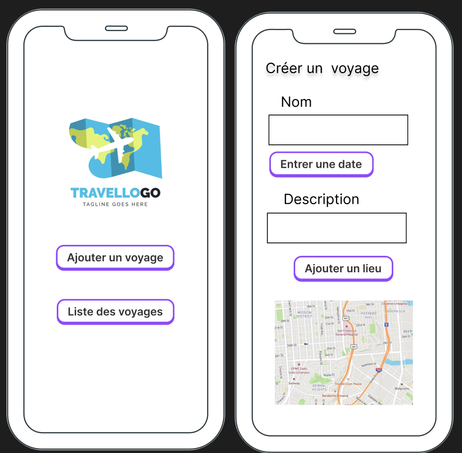
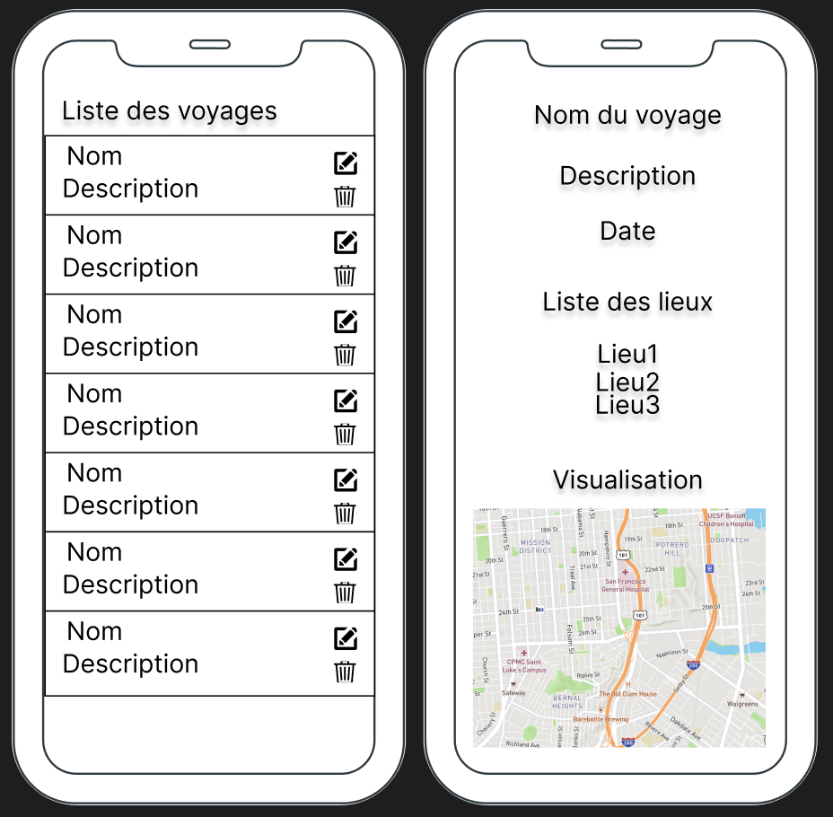
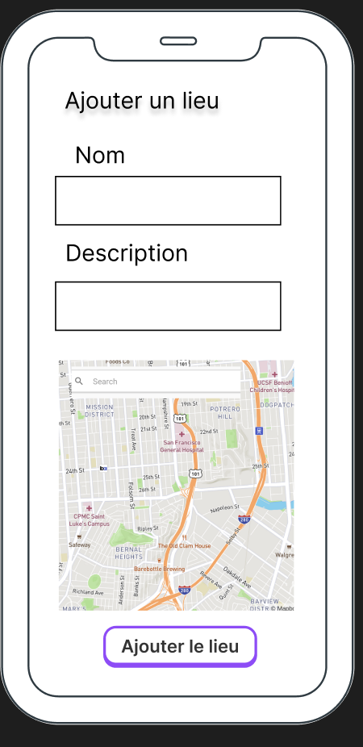
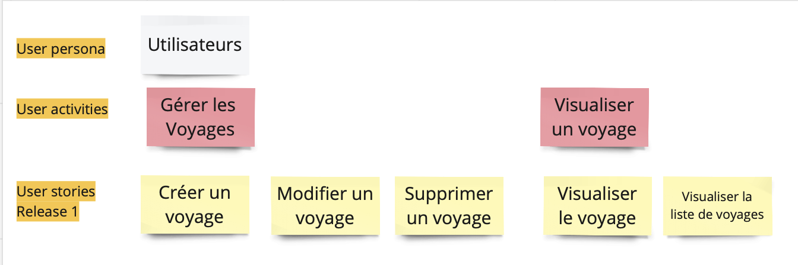
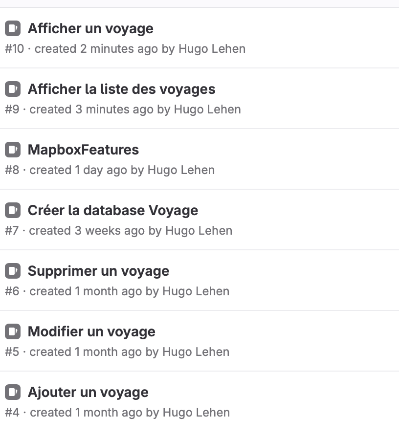

# REAMDE -- Extract from a personal university project 
## Projet carnet de voyage

## Contenu de l'application

L'application carnet de voyage permet de créer un voyage qui contient un nom, une date de début, une description et une liste de lieu, chaque lieu contient un nom, une description et des positions (longitude, latitude).

L'utilisateur peut consulter la liste de ses voyages 

Elle permet aussi de modifier et supprimer un voyage

## Maquettes de l'application 

Ces maquettes représentent les différentes pages de mon application réalisées lors de la phase de spécification de l'application. 

## Story mapping 

Voici le story mapping de l'application contenant les Users story embarqués pour la réalisation de l'application

## Issues

Voici la liste des issues embarqués lors de la réalisation de l'application (voir Board Github pour la version finale)

## Tests

Pour tester cette application, j'ai utiliser le framework de test Junit.

J'ai fait 3 fonctions de test qui permettent de tester la base de donnée des voyage sur les opérations Create(Post), Read(get), Update et Delete 

## Auteur

Hugo
